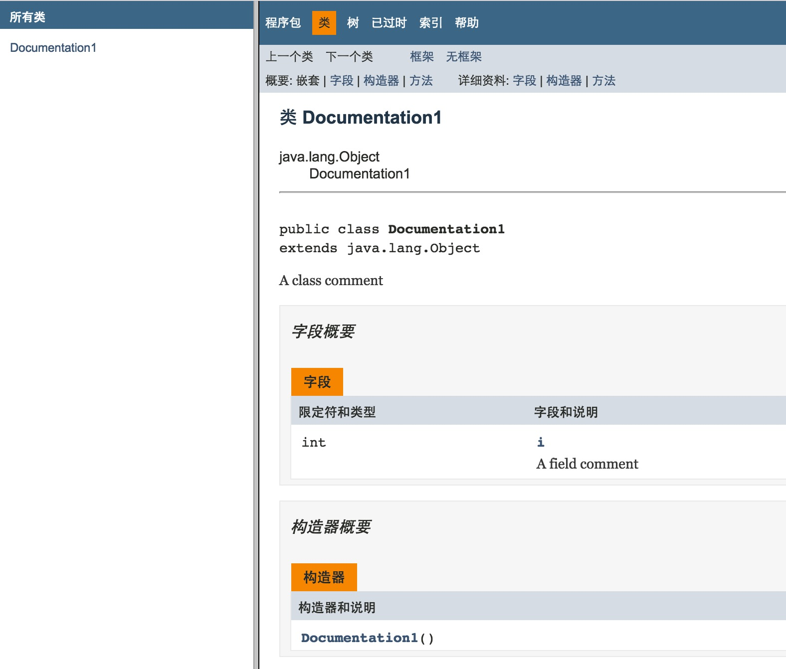

#第二章 一切都是对象

​	Java和C++都是一种杂合语言，但在Java中，设计者觉得这种杂合并不像在C++里显得那么重要。杂合语言允许采用多种编程风格；之所以说C++是一种杂合语言，是因为它支持与C语言的向后兼容能力。由于C++是C的一个超集，所以包含的许多特性是C语言所不具备的，这些特性使C++某些地方显得过于复杂。
##2.1 用句柄操纵对象

​	尽管把一切都看成对象，Java中操纵的标识符实际上是指向一个对象的句柄（Handle，有些地方称之为“引用”甚至是“指针”）。
​	句柄可以独立存在，String s;实际上只创建了一个句柄，没有与任何对象连接，对它发消息会报错。因此，一种更安全的做法是：创建一个句柄时，无论如何都要对其初始化。

##2.2 所有类型都必须创建

###2.2.1 保存到什么地方

​	有六个地方可以保存数据：

1. 寄存器
   位于CPU中，速度最快，数量有限，由编译器控制。
2. 堆栈
   位于RAM中，使用堆栈指针访问，指针向上释放内存，向下创建新的内存，Java编译器必须准确知道所有数据的“长度”和“存在时间”，因为它必须生成响应的代码，控制指针上下移动。这一限制影响了程序的灵活性，所以仅有句柄会被保存在堆栈中，对象本身不放到其中。
3. 堆
   一种常规用途的内存池，保存着Java的对象。Java不必知道数据需要分配的存储空间和停留时间。
   使用new关键字创建对象时，Java编译器会把这些对象存储在堆中。
   灵活性带来的是分配存储时间会更加耗时。
4. 静态存储
   静态指的是位于固定位置（也在RAM中）。静态数据在程序运行期间将随时等候调用。对象中的某些元素可由static关键字指定为静态的。但是Java对象本身永远不会被置入静态存储空间。
5. 常数存储
   常数值通常直接存储在程序代码内部，因为它们永远不会改变。有的常数需要严格保护，所以可以考虑置入只读存储器（ROM）。
6. RAM之外
   数据独立于程序之外、程序不运行时仍可存在、在程序的控制范围之外。
   两个主要的例子：“流式对象”和“固定对象”。
   对于前者，对象会变成字节流，通常会发给另一台机器。
   对于后者，对象保存在磁盘中。
   程序停止运行时，他们也可以保持自己的状态不变，如有需要，可将它们恢复成普通的机遇RAM的对象。

###2.2.2 特殊情况：主要类型
​	这类数据需要经常使用到，所以不用new关键字创建对象，因为new创建的对象放在堆里，Java和C与C++一样，对它们创建一个非句柄的“自动”变量，变量中存储了数据的值，并直接存储在堆栈中，便于高效存取。
Java定义了每种主要类型的大小，且不随着机器结构的变化而变化，这是Java平台无关性的原因之一。

| 主类型     |  大小  |    最小值    |      最大值       |     封装器类型 |
| ------- | :--: | :-------: | :------------: | --------: |
| boolean |  1位  |     -     |       -        |   Boolean |
| char    | 16位  | Unicode 0 | Unicode 2^16-1 | Character |
| byte    |  8位  |   -128    |      127       |      Byte |
| short   | 16位  |   -2^15   |     2^15-1     |     Short |
| int     | 32位  |   -2^31   |     2^31-1     |   Integer |
| long    | 64位  |   -2^63   |     2^63-1     |      Long |
| float   | 32位  |  IEEE754  |    IEEE754     |     Float |
| double  | 64位  |  IEEE754  |    IEEE754     |    Double |
| Void    |  -   |     -     |       -        |      Void |

​	数值类型全都是有符号的，主数据类型都有自己的封装器类型，如果想让一个堆内的一个非主要对象表示主类型，就要使用对应的封装器。
​	例：

```java
char c = 'x';
Character C = new Character(c);
```

​	或者是

```java
Character C = new Character('x');
```

​	

1. 高精度数字
   Java中增加了两个类用于高精度计算，它们是BigInteger和BigDecimal，用法类似于封装类，不同的是，它们指没有对应的主类型。
   BigInteger可以表示任意精度的整数，BigDecimal可以表示任意精度的定点数字，常用于计算货币。基本数据类能做的事情，它们也都能做，但是不能使用运算符，只能使用本身的方法。
   计算起来速度会比较慢，但是运算速度的降低带来的是精度的提升。

### 2.2.3 Java的数组

​	在C或者C++中使用数组的危险性在于数组仅仅是一个内存块，如果访问超出内存块的范围或者在未初始化的时候访问内存块，会产生不可预料的错误。
Java数组可以保证被初始化，Java中建立数组时，实际上是建立了一个句柄数组，每个句柄都会被初始化，且带有一个null，当编译器看到null，就知道这个句柄还没有指向一个对象，所有的句柄都需要被初始化。
也可以创建主类型数组，初始化为0。

## 2.3 永远不需要销毁对象 

### 2.3.1 作用域

​	在C、C++和Java中，作用域由花括号的位置决定。而且，Java中为了避免混乱，以下在C和C++中正确的写法是不允许的：

```C++
int x = 12;
{
	int x = 96;//Illegal
}
```

### 2.3.2 对象的作用域

​	Java的对象不具有和和基本类型一样的生命周期。当用new创建一个新的Java对象时，它可以存活于作用域之外：

```java
{
  String s = new String("a String");
}//End of scope
```

​	在上面的代码中，引用s在作用域终点就消失了，但是对象会一直存在，一直占据着内存空间，Java使用“垃圾回收器”机制来防止内存被这种无用的对象塞满，它会检测内存中的对象，如果发现其已经不会再被引用就将其销毁，释放内存。垃圾回收器只能监视使用new关键字创建的对象。

## 2.4 创建新的数据类型：类

### 2.4.1 字段和方法

​	对于一个类，如果其中的字段是对某个对象的引用，那么必须初始化该引用。

​	如果类的某个成员是基本数据类型，即使没有进行初始化，Java也会确保它获得一个默认值（C和C++不会，），基本数据类型和其默认值如下表所示：

|  基本类型   |      默认值       |
| :-----: | :------------: |
| boolean |     false      |
|  char   | '\u0000'(null) |
|  byte   |    (byte)0     |
|  short  |    (short)0    |
|   int   |       0        |
|  long   |       0L       |
|  float  |      0.0f      |
| double  |      0.0d      |

​	上述确保初始化的方法并不适合局部变量，局部变量可能会是任意值，所以必须进行初始化，否则C或C++给出警告，而Java则会直接返回错误，这正是Java优于C++的地方。

## 2.5 方法、参数和返回值

​	Java中惯用“方法”描述“做某些事的方式”，一般在C或C++中，会使用“函数”这一称呼，这只是用词上的差别。

​	Java的方法决定了一个对象能接收什么样的消息。方法的基本组成部分包括：名称、参数、返回值和方法体。下面是它最基本的形式：

```java
ReturnType methodName(/* Argument list */){
  /* Method body */
}
```

​	方法名和参数列表合起来被称为“方法签名”，能够唯一地标识出某个方法。

​	调用方法的行为通常被称为**发送消息给对象**。

​	一般的方法只能通过对象来调用，static方法是针对类调用的。

### 2.5.1 参数列表

​	通常情况下，向方法的参数列表传递参数与Java中其他传递对象的场合一样，传递的是对象的引用。但是特殊数据类型除外。

​	return语句可以退出方法，返回值可以是任意类型，程序也可以在方法的任何部位返回。另外如果返回类型不是void，那么无论在何处返回，编译器都会返回一个正确类型的返回值。

## 2.6 构建一个Java程序

### 2.6.1 名字可见性

​	名字可见性描述的是同一个程序中不同模块的名字冲突的问题，该问题在C中最为严重，C++类将函数包于其内，从而避免了与其它类中的函数名相冲突。但是，由于C++中仍然允许全局变量和全局函数的存在，所以还是会有冲突。味了解决这个问题，C++通过几个关键字引入了**名字空间**的概念。

​	Java使用了一个全新的方法解决以上问题，Java希望程序员们反过来使用自己的域名，这样能保证它们肯定是独一无二的。这种机制意味着所有的文件都可以自动存活于它们自己的名字空间内，而且同一个文件里的不同类都有一个唯一的标识符。

### 2.6.2 运用其他构件

​	Java解决了“向前引用”的问题，引用的位置不必在类定义之后。

### 2.6.3 static关键字

​	**static**关键字可以用来解决两个主要的问题，一是只想为特定域分配单一存储空间而不必考虑将要创建多少对象（甚至不创建对象）；二是希望某个方法不与这个类的任何方法关联在一起，即使不创建对象也可以调用这个方法。

​	**static**可以用来修饰类的字段和方法，有些文献中将它们称为**类数据**和**类方法**。

​	使用**static**关键字修饰字段的时候，无论创建多少个对象，它们的静态字段都只有一份存储空间（这个时候肯定会改变数据创建的方法）。可以使用对象或者使用类来调用该字段。

​	使用**static**修饰方法的时候，也可以使用类或者对象中的任意一个来调用静态方法。

## 2.7 你的第一个Java程序

​	下面创建了一个简单的Java程序：

```java
// HelloDate.java
import java.util.*;

public class HelloDate{
	public static void main(String[] args){
		System.out.println("Hello, it's ");
		System.out.println(new Date());
	}
}
//Hello, it's 
//Tue Aug 16 00:12:32 CST 2016
```

​	有一个特定类会被引入到每一个Java文件中，那就是java.lang。

​	在"System.out.println();"中，System是一个类，out是其中的一个静态PrintStream对象，println是其一个静态方法。

​	下面是另外一个示例程序：

```java
//: object/ShowProperties.java

public class ShowProperties{
  public static void main(String[] args){
    System.getProperties().list(System.out);
   	System.out.println(System.getProperty("user.name"));
   	System.out.println(
   		System.getproperty("java.library.path"));
  }
}///:~
```

输出结果如下：

```tex
-- listing properties --
java.runtime.name=Java(TM) SE Runtime Environment
sun.boot.library.path=/Library/Java/JavaVirtualMachines/jdk...
java.vm.version=25.101-b13
gopherProxySet=false
java.vm.vendor=Oracle Corporation
java.vendor.url=http://java.oracle.com/
path.separator=:
java.vm.name=Java HotSpot(TM) 64-Bit Server VM
file.encoding.pkg=sun.io
user.country=CN
sun.java.launcher=SUN_STANDARD
sun.os.patch.level=unknown
java.vm.specification.name=Java Virtual Machine Specification
user.dir=/Users/Howie/Documents/test
java.runtime.version=1.8.0_101-b13
java.awt.graphicsenv=sun.awt.CGraphicsEnvironment
java.endorsed.dirs=/Library/Java/JavaVirtualMachines/jdk...
os.arch=x86_64
java.io.tmpdir=/var/folders/x0/kz6zrvzd66lbjzjnx3k49...
line.separator=

socksProxyPort=1080
java.vm.specification.vendor=Oracle Corporation
os.name=Mac OS X
sun.jnu.encoding=UTF-8
java.library.path=/Users/Howie/Library/Java/Extensions:...
java.specification.name=Java Platform API Specification
java.class.version=52.0
sun.management.compiler=HotSpot 64-Bit Tiered Compilers
os.version=10.11.6
user.home=/Users/Howie
user.timezone=
java.awt.printerjob=sun.lwawt.macosx.CPrinterJob
file.encoding=UTF-8
java.specification.version=1.8
user.name=Howie
java.class.path=.
socksProxyHost=127.0.0.1
java.vm.specification.version=1.8
sun.arch.data.model=64
java.home=/Library/Java/JavaVirtualMachines/jdk...
sun.java.command=ShowProperties
java.specification.vendor=Oracle Corporation
user.language=zh
awt.toolkit=sun.lwawt.macosx.LWCToolkit
java.vm.info=mixed mode
java.version=1.8.0_101
java.ext.dirs=/Users/Howie/Library/Java/Extensions:...
sun.boot.class.path=/Library/Java/JavaVirtualMachines/jdk...
java.vendor=Oracle Corporation
file.separator=/
java.vendor.url.bug=http://bugreport.sun.com/bugreport/
sun.cpu.endian=little
sun.io.unicode.encoding=UnicodeBig
sun.cpu.isalist=
Howie
/Users/Howie/Library/Java/Extensions:/Library/Java/Extensions:/Network/Library/Java/Extensions:/System/Library/Java/Extensions:/usr/lib/java:.
```

### 2.7.1 编译和运行

​	编译：

```java
javac file.java
```

​	运行：

```java
java classname
```

## 2.8 注释和嵌入文档

### 2.8.1 注释文档

​	将代码和文档链接起来。

### 2.8.2 语法

​	javadoc命令以“/* *”开头，以“ */”结尾。

​	使用javadoc的方法有两种，一种是嵌入HTML，另一种是使用“文档标签”。

​	文档标签分为两种，**独立文档标签**是以一些“@”自负开头的命令，且要置于注释行的最前面（位于该行的“*”之后）。**行内文档标签**则可以出现在javadoc注释中的任何地方，它们也是以“@”字符开头，但是位于花括号内部。

​	总共有三种类型的注释文档，分别对应于注释位置后面的三种元素：类、域和方法。即类注释正好位于类的定义之前；域注释正好位于域的定义之前；方法注释正好位于方法定义之前。

​	javadoc的一个例子如下所示：

```java
//: object /Documentation1.java
/** A class comment */
public class Documentation1 {
	/** A field comment */
	public int i;
	/** A method comment */
	public void f(){
	}
}///:~
```

​	其生成的javadoc样式如下图所示：




​	注意javadoc只能为**public**（公共）和**private**（受保护）成员进行文档注释。**private**（私有）和包内可访问成员的注释会被忽略掉（可以使用**-private**选项进行标记，以便把**private**成员的注释也包含在内）。

### 2.8.3 嵌入式HTML

​	可以直接在javadoc中插入HTML代码，但是注意不要在嵌入式HTML标签中使用**\<h1\>**或**\<hr\>**标签，因为javadoc会插入自己的标题，而你的标题可能会和它们产生冲突。

​	所有类型的注释文档——类、域和方法都支持嵌入式HTML。

### 2.8.4 一些标签示例

1. @see：引用其他类

   ​	@see标签允许用户引用其他类的文档，可以被用来在生成的HTML文档中链接到其他文档。文档中会生成一个“See Also”（参见）条目。但是javadoc不会检查你所提供的超链接是否有效。

2. {@link package.class#member label}

   ​	与@see标签极为类似，只不过它用于行内，而且使用“label”链接而不是“See Also”。

3. {@docRoot}

   ​	该标签会产生到文档根目录的相对路径，用于文档树页面的显式超链接。

4. {@inheritDoc}

   ​	该标签从当前类的最直接基类中集成相关文档到当前的文档注释中。

5. @version

   ​	该标签的使用格式如下：

   ```java
   @version version-infomation
   ```

   ​	其中“**version-infomation**”是需要包含在版本说明中的重要信息，如果javadoc命令行使用了“**-version**”标记，那么就从生成的HTML文档中特别提取出版本信息。

6. @author

   ​	该标签的使用格式如下：

   ```java
   @author author-infomation
   ```

   ​	其中“**author-infomation**”是需要包含在作者说明中的重要信息，如果javadoc命令行使用了“**-author**”标记，那么就从生成的HTML文档中特别提取出作者信息。

   ​	该标签可以使用多个，以便列出所有的作者，但是它们必须连续放置。

7. @since

   ​	该标签允许你指定程序代码使用的最早的版本，可以在HTML文档中看到它被用来指定所用的JDK版本的情况。

8. @param

   ​	该标签用于方法文档中，形式如下：

   ```java
   @param parameter-name description
   ```

   ​	 其中，**parameter-name**是方法的参数列表中的标识符，**description**是可以延续数行的文本，终止于新的文档标签出现之前。可以使用任意多个这种标签，大约每隔参数都有一个这样的标签。

9. @return

   ​	该标签用于方法文档，形式如下：

   ```java
   @return description
   ```

   ​	其中，**description**用来描述返回值的含义，可以延续数行。

10. @throws

    ​	形式如下：

    ```java
    @throws fully-qualified-class-name description
    ```

    ​	其中，**fully-qualified-class-name**是一个异常类的无歧义名字，**description**（同样可以延续数行）解释了为什么会出现这个异常。

11. @deprecated

    ​	该标签用于指出一些特性已由改进的新特性所取代，建议用户不要再使用这些特性，因为它们将来可能会被删除。如果使用一个标记为**@deprecated**的方法，则会引起编译器发布警告。

    ​	在Java SE5中，Javadoc标签@deprecated已经被@Deprecated注解所替代。

### 2.8.5 文档示例

​	仍然使用本书中第一个Java程序作为示例：

```java
//: object/HelloDate.java
import java.util.*;

/** The first Thinking in Java example program.
* Displays a String and today’s date.
* @author Bruce Eckel
* @author www.MindView.net
* @version 4.0
*/
public class HelloDate{
	/** Entry point to class & application.
	* @param args array of string arguments
	* @throws exceptions No exceptions thrown
	*/
	public static void main(String args[]){
		System.out.println("Hello, it's ");
		System.out.println(new Date());
	}
} /* Output:(55% match)
Hello. it’s:
Wed Oct 05 14:39:36 MDT 2005
*///:~
```

​	其中，**//:**是本书的特别格式，表明是包含源文件名的注释行；**///:~**标志着源码清单的结束。

​	**/*Output**标签表输出的开始部分将由这个文件生成，通过这种形式，它会被自动地测试以验证其准确性。55%表示本次输出和下次输出预期只有55%的相关性。

## 2.9 编码风格

​	在[“**Java编程语言编码约定**”](http://java.sun.com/docs/codeconv/index.html)中，代码风格是这样规定的：类名的首字母要大写，如果类名是由数个单词组成的，那么每个单词的首字母都要大写，这种风格也被称为驼峰风格。

​	几乎所有的其他内容——方法、字段以及对象引用名称等，公认的风格与类的风格一样，只不过标志符的第一个字母小写。

## 2.10 总结

​	本章主要讲述了如何编写一个简单的Java程序以及Java的一些基本思想。

​	本章的示例程序都是顺序结构，下一章将会介绍分支结构。

## 2.11 练习

